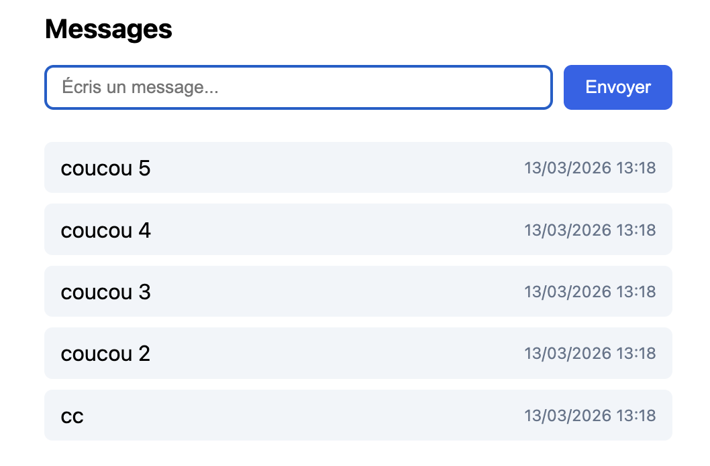
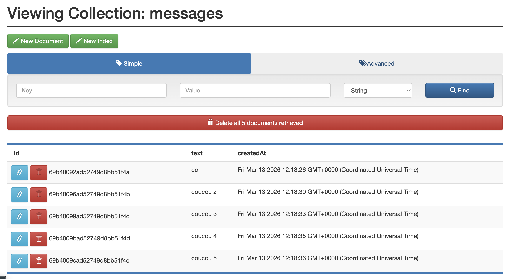
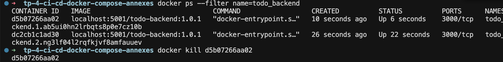
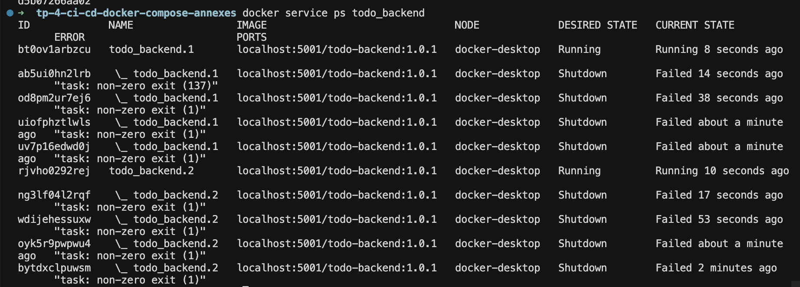

# TP 4 — CI/CD avec Docker, Compose et Swarm

## Sommaire

1. [Objectif du TP](#1-objectif-du-tp)
2. [Architecture](#2-architecture)
3. [Structure du projet](#3-structure-du-projet)
4. [Lancer l'application en local](#4-lancer-lapplication-en-local)
5. [Exécuter les tests backend](#5-exécuter-les-tests-backend)
6. [Scan de sécurité des images](#6-scan-de-sécurité-des-images)
7. [Registre Docker local](#7-registre-docker-local)
8. [Déploiement avec Docker Swarm](#8-déploiement-avec-docker-swarm)
9. [Mise à jour d'une image](#9-mise-à-jour-dune-image)
10. [Tolérance aux pannes](#10-tolérance-aux-pannes)
11. [Sécurité](#11-sécurité)
12. [CI (GitHub Actions)](#12-ci-github-actions)
13. [Captures d'écran des résultats](#13-captures-décran-des-résultats)

---

## 1. Objectif du TP

Ce projet met en place une chaîne simple d'intégration et de déploiement continu pour une application web composée de :

- un **backend Node.js**
- un **frontend Nginx**
- une base **MongoDB**
- un outil d'administration **Mongo Express**

Le pipeline réalisé permet de :

- construire les images Docker (Dockerfiles multi-stage)
- exécuter les tests backend
- scanner les images avec Trivy
- générer un SBOM
- publier les images dans un registre Docker local
- déployer l'application avec Docker Swarm
- mettre à jour les services avec une nouvelle version d'image (sans interruption, start-first)

---

## 2. Architecture

Application composée de 4 services :

```
Frontend (Nginx)
        |
        v
Backend (Node.js API)
        |
        v
MongoDB
        |
        v
Mongo Express (admin interface)
```

**Ports exposés :**

| Service        | Port |
|----------------|------|
| Frontend       | 8082 |
| Backend        | 3000 |
| Mongo Express  | 8081 |
| Registry local | 5001 |

---

## 3. Structure du projet

```
tp-4-ci-cd-docker-compose-annexes/

backend/
 ├── Dockerfile
 ├── package.json
 └── server.js

frontend/
 ├── Dockerfile   # multi-stage : builder (fichiers statiques + health) → runtime Nginx
 └── index.html

ops/
 ├── dev.env
 └── .env.sample

reports/
 ├── README.md
 ├── todo-backend-trivy.txt
 ├── todo-backend-bom.json
 ├── todo-frontend-trivy.txt
 └── todo-frontend-bom.json

docs/
 └── ci-cd.md

docker-compose.yml
compose.swarm.yml
Makefile
README.md
```

**Healthcheck frontend :** le Dockerfile du frontend crée un fichier `health` dans le stage builder et le copie vers `/usr/share/nginx/html/health`. Le healthcheck Nginx (`HEALTHCHECK ... wget -qO- http://127.0.0.1/health`) renvoie ainsi 200 et permet à Docker/Swarm de vérifier que le conteneur répond.

---

## 4. Lancer l'application en local

Construire et démarrer les services :

```bash
docker compose up --build
```

Ou via le Makefile :

```bash
make up
```

**Services accessibles :**

| URL                      | Service        |
|--------------------------|----------------|
| http://localhost:8082    | Frontend       |
| http://localhost:3000    | Backend (API)  |
| http://localhost:8081    | Mongo Express  |

Arrêt et nettoyage :

```bash
make down
```

---

## 5. Exécuter les tests backend

Les tests sont exécutés dans un conteneur Docker (image builder) :

```bash
make test
```

**Pourquoi tester depuis l’image builder ?** L’image builder contient toutes les dépendances (npm, node_modules) et le code source ; on évite d’installer quoi que ce soit sur l’hôte et on garantit que les tests tournent dans le même environnement que le build. Une image dédiée uniquement aux tests serait plus lourde à maintenir ; ici réutiliser le stage builder est un bon compromis (performance du cache Docker, simplicité). Pour le frontend, on pourrait soit monter le code en volume avec une image Node (`docker run -v ... node:20-alpine npm test`), soit ajouter un stage de test dans le Dockerfile — le volume est plus simple pour un front léger, une image dédiée devient utile si les tests (lint, e2e) sont nombreux.

---

## 6. Scan de sécurité des images

Analyse des vulnérabilités avec Trivy et génération du SBOM :

```bash
make scan
```

Les rapports sont générés dans `reports/` :

- `todo-backend-trivy.txt` / `todo-backend-bom.json`
- `todo-frontend-trivy.txt` / `todo-frontend-bom.json`

---

## 7. Registre Docker local

**Démarrage du registre :**

```bash
docker run -d -p 5001:5000 --name registry registry:2
```

**Tag des images :**

```bash
docker tag todo-backend:latest localhost:5001/todo-backend:1.0.0
docker tag todo-frontend:latest localhost:5001/todo-frontend:1.0.0
```

**Push des images :**

```bash
docker push localhost:5001/todo-backend:1.0.0
docker push localhost:5001/todo-frontend:1.0.0
```

---

## 8. Déploiement avec Docker Swarm

**Initialisation du cluster :**

```bash
docker swarm init
```

**Déploiement de la stack :**

```bash
docker stack deploy -c compose.swarm.yml todo
```

**Vérifier les services :**

```bash
docker service ls
docker service ps todo_backend
docker service ps todo_frontend
```

---

## 9. Mise à jour d'une image

Exemple de mise à jour du backend (nouvelle version d'image) :

```bash
docker service update \
  --image localhost:5001/todo-backend:1.0.1 \
  todo_backend
```

La stratégie `order: start-first` dans `compose.swarm.yml` permet de démarrer la nouvelle tâche avant d'arrêter l'ancienne, pour une mise à jour sans interruption visible.

---

## 10. Tolérance aux pannes

Simulation d'un crash :

```bash
docker ps --filter name=todo_backend
docker kill <container_id>
```

Docker Swarm recrée automatiquement un nouveau conteneur pour maintenir le nombre de réplicas (voir captures d'écran en fin de document).

---

## 11. Sécurité

- scan de vulnérabilités avec Trivy
- génération d'un SBOM (CycloneDX)
- variables d'environnement séparées (`ops/dev.env`, `ops/.env.sample`)
- secrets et fichiers sensibles non versionnés (`.gitignore`)

Documentation du pipeline CI/CD et gestion des secrets en production : `docs/ci-cd.md`.

---

## 12. CI (GitHub Actions)

Le workflow `.github/workflows/ci.yml` s’exécute à chaque push et pull request sur `main` / `master` :

1. **Build** des images backend et frontend.
2. **Tests** backend dans un conteneur (`npm test`).
3. **Scan Trivy** des deux images (rapports table + SBOM CycloneDX) ; le job échoue s’il y a des vulnérabilités **CRITICAL**.
4. **Smoke test** : démarrage de la stack avec `docker compose up`, vérification du backend (`/api/message`) et du frontend (port 8082), puis arrêt.

Les rapports Trivy sont publiés en artefacts de l’action. Pour désactiver l’échec sur CRITICAL, commenter ou adapter l’étape « Fail on CRITICAL vulnerabilities » dans le workflow.

**Note (projet scolaire / TP)** : les identifiants utilisés en CI (mots de passe MongoDB, Mongo Express) sont en clair dans le workflow et ne sont pas stockés dans les GitHub Secrets ; c'est volontaire pour ce TP (environnement éphémère, valeurs factices). En production, utiliser les secrets.

---

## 13. Captures d'écran des résultats

### Frontend (http://localhost:8082)



### Mongo Express (http://localhost:8081)



### Tolérance aux pannes — avant kill



### Tolérance aux pannes — après kill (recréation des tâches)


